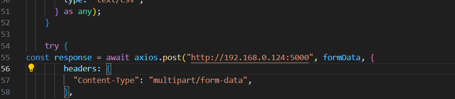

# react-native-keras-api
primeiramente rode o npm install para instalar todas as dependencias do react-native 

##### run 
Para instalar as dependencias do python 

```
pip install -r requirements.txt
```

##### run applications
fastapi dev main.py --port 5000 --host 0.0.0.0

```
Em frontend/my-app/app/index/index - Na linha 55 troque pelo ip da sua maquina
```
